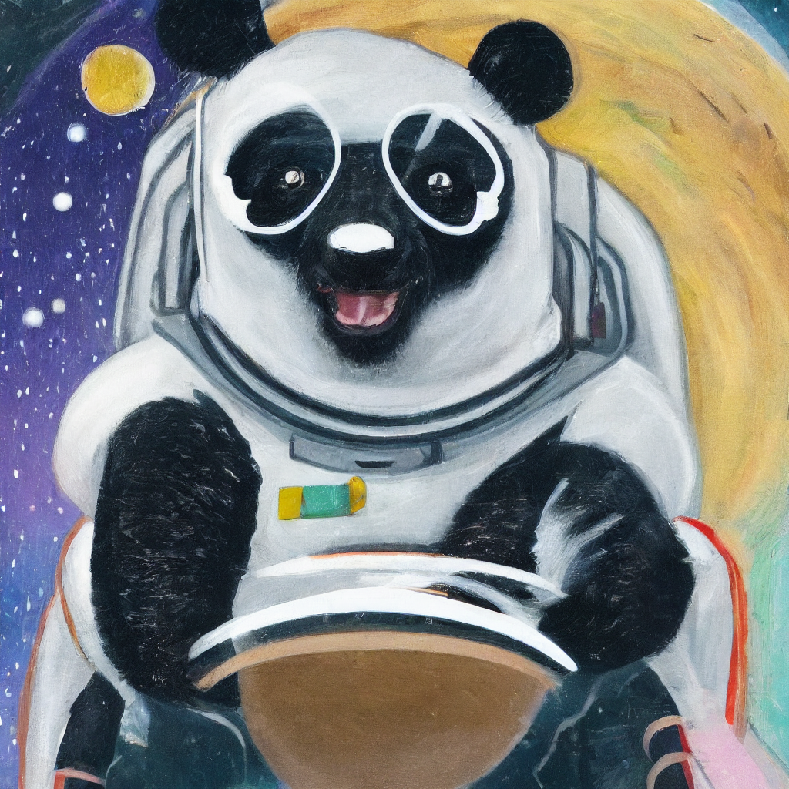

# Stable diffusion with upscaler




## Environment
Supported on Python 3.8 to 3.11.
Expected to run on a GPU.

## How to install
### 1. Clone this repo
```
git clone https://github.com/y26805/stable_diffusion_with_upscaler.git
```

### 2. Install dependencies
For poetry users, run
```
cd stable_diffusion_with_upscaler/
poetry install
```

For pip users,  run
```
cd stable_diffusion_with_upscaler/
pip install -e .
```

### 3. Clone related directories
```
git clone https://github.com/CompVis/stable-diffusion
git clone https://github.com/CompVis/taming-transformers
git clone https://github.com/CompVis/latent-diffusion
```

## How to run

(Optional) for poetry users, run
```
poetry shell
```

Running the follow will save a file in the `outputs/` folder.
```
python3 stable_diffusion_with_upscaler/run.py --prompt "panda in space"
```

Output images have a resolution of 1024x1024 pixels.
